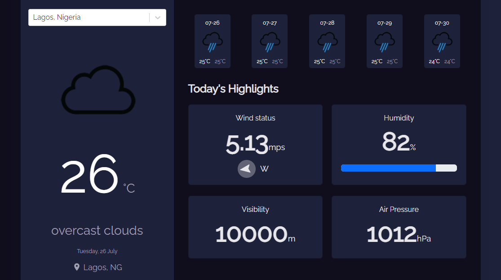

<h1 align="center">React Weather App</h1>

<div align="center">
   Solution to a challenge from  <a href="http://devchallenges.io" target="_blank">Devchallenges.io</a>.
</div>

<div align="center">
  <h3>
    <a href="https://smtoyedeji.github.io/react-weather-app/" target="_blank">
      Live Website
    </a>
    <span> | </span>
    <a href="https://github.com/smtoyedeji/react-weather-app.git">
      Github Repo
    </a>
  </h3>
</div>

## Table of Contents

- [Overview](#overview)
  - [Built With](#built-with)
  - [Roadmap](#roadmap)
- [How to use](#how-to-use)
- [Contact](#contact)
- [Acknowledgements](#acknowledgements)


## Overview



I stumbled on devchallenges.io on a Google search. I was impressed with the frontend coding challenges. The figma design of the weather app particularly inspired me. I decided to tweak the design template and came up with this weather app.

### Built With

- [ReactJS](https://reactjs.org/)
- [React Bootstrap](https://react-bootstrap.github.io/)
- [OpenWeather API](https://openweathermap.org/)
- [GeoDB Cities API](http://geodb-cities-api.wirefreethought.com/)

### Roadmap
1. I would love to add a functionality that loads user location and updates the weather components by default.
2. Display an alert window when a location search returns nothing or an error.
3. Add dark/light mode button to the app.


## How To Use

To clone and run this application, you'll need [Git](https://git-scm.com) and [Node.js](https://nodejs.org/en/download/) (which comes with [npm](http://npmjs.com)) installed on your computer. From your command line:

```bash
# Clone this repository
$ git clone https://github.com/your-user-name/your-project-name

# Install dependencies
$ npm install

# Run the app
$ npm start
```


## Contact

- GitHub [@smtoyedeji](https://github.com/smtoyedeji)
- Twitter [@oyedeji__](https://twitter.com/oyedeji__)
